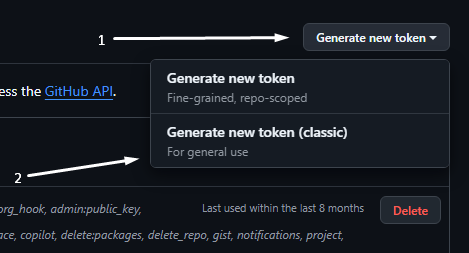

<div align="center">

# Hq SteamTools Manifest Downloader

  
[](https://discord.gg/bH9w3UmgYe)
</div>

> [!CAUTION]
> This tool is unofficial and not affiliated with Valve/Steam. 
> Use at your own risk.

## How to download
Go to [GitHub Releases](https://github.com/ImHartash/HqSteamToolsManifestDownloader/tree/Releases) and select version you want. 

## Developing

This project made on Python with version 3.11
All libs allocated in `requirements.txt`

Usage:
```
pip freeze -l > requirements.txt
```

## How to Get 5000 Requests per Hour Instead of 60?

To do this, you need to enter your GitHub token in the `github_token` field in the config after logging into your GitHub account..

#### How to Get the Token?

1. Go to the [GitHub token creation page](https://github.com/settings/tokens).

2. Click on "**Generate new token**" at the top left and select "**Generate new token (classic)**".


3. In the "**Note**" field, enter a name for the token (any name), and in the "**Expiration**" field, set the token's expiration date (your choice).

4. Check the boxes for **repo** and **user**, then click "**Generate token**".

5. Copy the token code (it starts with `ghp_`) and paste it into the config.

6. You can verify the changes (for example, by using "**Check my requests amount (GitHub)**").

After this, you'll have **5000 requests per hour**, which will reset every hour. If you have any questions, feel free to ask in my Discord server.

Good Luck!